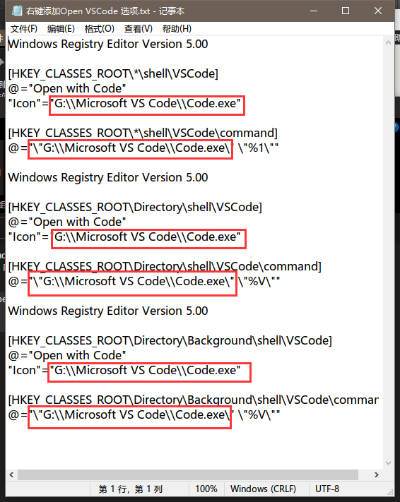
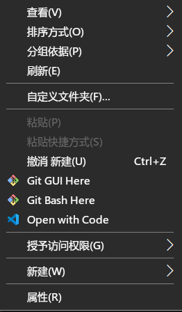

# -Open-VScode-
创建了一个**右键添加Open VScode的**txt文件
此.tet文件的目的是为了在鼠标右键菜单中添加Open With VScode的选项以用来提升开发效率

> 如果看完不会，欢迎拿刀砍我！！！
## 为啥要写这个
----
VScode是我日常中常用的IDE软件，但是每当我要将某些文件添加到VScode中进行编辑时每次都要在VScode中打开，这让我感觉十分的繁琐。:)111
##怎么做?

----

1.下载我仓库中的.txt文件
2.更改文件中关于VScode位置的部分

> 注意
>
> 1. **一定要注意要用     " \\ "   取代    " \ "**
> 2. 需要替换的为G:\\Microsoft VS Code\\Code.exe  
> 3. 注意不要多删除 " \ "

3.另存文件为.reg格式的文件并保存到桌面

如下图所示

然后运行就OK啦  

//

